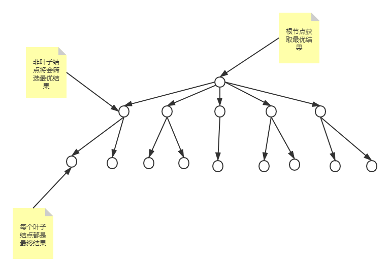
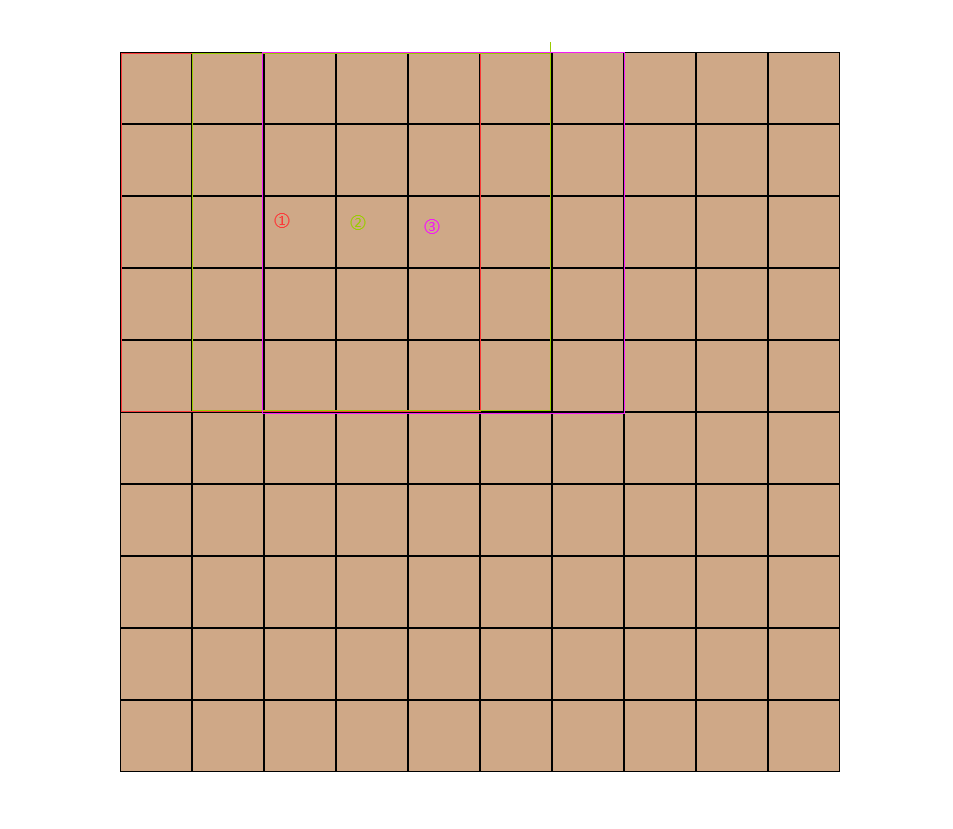

# 学习笔记

## 一、本周学习内容

本周学习内容包括两个方面：追溯法及异步编程。视频中使用了追溯法实现了 `tictactoc` 的人机以及使用异步编程实现红绿灯的模拟。

### 1. 追溯法的理解

本周最大的学习内容就是追溯法，根据老师在 `tictactoc` 实现中，我的理解认为追溯法最初形态类似于枚举，只不过与普通枚举不同，追溯法的枚举类似于树形结构的枚举，我们将每一次下棋的结果作为树的节点，向下引申出接下来的子节点，也就是下一步棋，当我们遍历出来每个叶子节点的结果，再在每个非叶子节点获取最好的结果，最后到达根节点的结果一定是最好的，我的理解如下图所示：

但是追溯法缺陷比较明显：依赖一个很好地剪枝方案（ 在简单地胜负剪枝情况下， 3 * 3 的计算次数为两千多次， 但 5 * 5 就算限制追溯层级就有两万多的计算量），简单地剪枝方案的计算量是非常大的，所以在课后作业的五子棋中，简单地剪枝不能满足需求，需要比较复杂的剪枝策略。

### 2. 异步编程理解

对于异步编程，之前也有过学习，对于 `Promise`, `async` `await` 函数都有过一定的使用，但是对 `Generator` 的使用比较少，根据课上的使用来看函数返回的结果为一个指针，通过调用 `next` 方法移动指针，获取 `yield` 语法向指针后写入的数据， `yield` 函数执行时，将语法后的语句同步执行（ `yield` 后语句执行时，主线程暂停执行，协程开始执行，执行结束后返回结果的指针对象，主线程恢复执行）

## 二、五子棋的实现

由于五子棋的棋盘比较大，所以简单地使用追溯法一定会出现极大地计算量，所以我们需要一些方法优化它，由于时间并不充裕，暂时无法完全的完成该方案，所以我只能提出自己的想法

### 1. 输赢判断

在 3 * 3 的棋盘中，我们可以使用较为简单地循环逻辑去判断胜负（因为枚举量不大），但是五子棋的棋盘是 15 * 15 的格子，如果不使用合适的方法进行判断，我们需要按照人类下五子棋的方法去判断：当对方下一步棋的时候我们怎么判断当前棋势的。对于普通人来说下子周围 4 个点都是棋子的连珠的点，所以我们只需要对下子点周围 4 个点进行胜负判断即可，为了满足这种判断，我们将棋盘分为一个个 5 * 5 的子棋盘，当我们需要判断的时候，只需调用下子点周围 16 个子棋盘的输赢即可：图形切割如下：

10 * 10 的表格被切割为 36 个子表，我们在初始化时将每个子表的权值置为 [0, 0] 其中，第一个标识最小权值，第二个标识为最大权值（此例中我们将白子枚举设置为 1 ，黑子枚举设置为 -1 ），当下子时，我们更新下子点的四周的 16 个子棋盘的权值，最大权值达到五子连珠的时候，我们就可以判断输赢了。

### 2. 权值判断

棋子的权值是我们人工智能的关键，好的棋子权值的筛选能够剪去很多不必要的分支，五子棋的棋型有很多种，每一种棋型的权值都不一致（三连子的棋型权值比较高，但是如果跳一空的三子优先级会很低，我们将中间的白子出现时归零当前的连子权值，以降低整个权值），但权值计算还需优化

### 3. 人机实现

如果实现上述逻辑，人机的实现就会变得稍微简单一点，我们只需在人机下棋的时候判断当前所有权值表中我方最大权值以及对方最大权值的几个 5 * 5 的进行追溯法校验，且有优先级，其优先级为：我方能赢 > 敌方能赢 > 普通权值，且前两个方案得出结果时，其他方案便可不执行，很大程度上实现剪枝。

## 三、总结

经过一周的培训，收获还是很多的，在其中发现了很多之前没有主要到的一些基础语法的使用，经过一周的试训，也大致了解到培训需要多久的时间投入，今后将会作出相应调整，保证学习与工作的协调。
