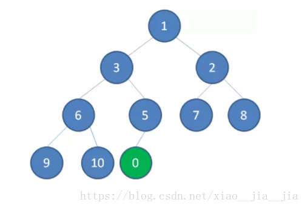
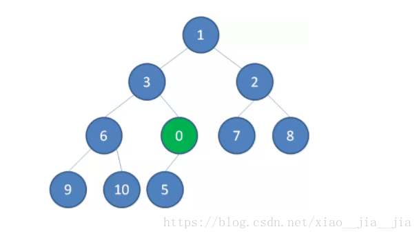
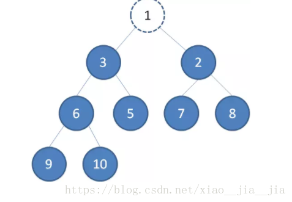
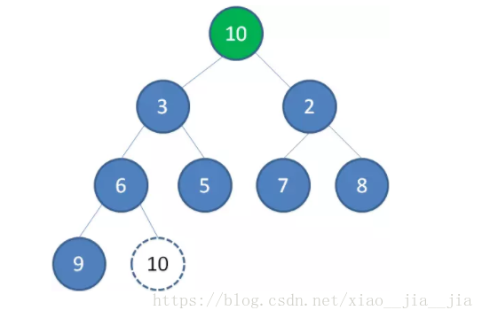

# 学习笔记

本周通过迷宫的实现学习两个方面知识

- 学习广度遍历算法的使用

- 学习二叉堆的结构及操作方式

## 1. 广度遍历算法使用

在此之前，有学习过深度遍历实现迷宫寻路，与广度遍历方法实现寻路方式不同，深度遍历寻路理念算是不撞南墙不回头，一条路走到黑，直到撞墙，再回头寻路，这也是普通人走迷宫的方式，它的寻路标识形状为深入型。而广度遍历的方式理念为一次性获取所有的可能，然后拿到抵达终点的路径，其寻路标识为扩散型。两种方式各有优缺点，深度遍历消耗的性能较小但是速度会比较慢，广度遍历性能消耗较大但是总体速度较快，在本次的学习中我们针对图形的特点可以实现广度优先的优化，能够将路径优化一定程度，但是在实际的复杂迷宫中，如果做这种优化会可能反而会影响寻路效率。

## 2. 二叉堆结构及操作方式

二叉堆是一个有规律可增删的二叉树，存储的方式为数组，其数组下标的规律如下：

```
    左子节点 = 父节点 * 2 + 1
    右子节点 = 父节点 * 2 + 2
```

其存储规律为：父节点小于（大于）子节点，那么当我们需要对二叉堆的增删时，就需要根据其特性进行排序。

### 2.1 二叉堆的新增

二叉堆的新增需要符合二叉堆的存储逻辑，我们将新增的节点放置于数组最后，也就相当于最后一个叶子节点，如下图：



此时新增节点的权值很小，需要将该节点向上移动，此时我们比较父节点与子节点的权值，如果不符合存储规律，则替换再次比较父节点，过程如下入所示：



当新增节点权值比较不再向上冒泡时，二叉堆便符合储存规律，新增成功

### 2.2 二叉堆的取出

与新增不同，当我们取值时，我们需要取根节点，此时二叉堆会散开，其中比较好的办法是将根节点与最后一个节点替换，再取出最后一个节点，此时二叉堆的结构如下：





此时根节点的权值大于其下面的两个节点，我们需要对根节点进行下沉操作，比较左右节点，当权值大于左右节点时，选择其中一个子节点替换下沉，循环往复，最后当权值小于子节点时，则表示二叉堆符合规律，删除成功。

在新增与取出的操作中，复杂度为log(n)，小于普通数组的排序