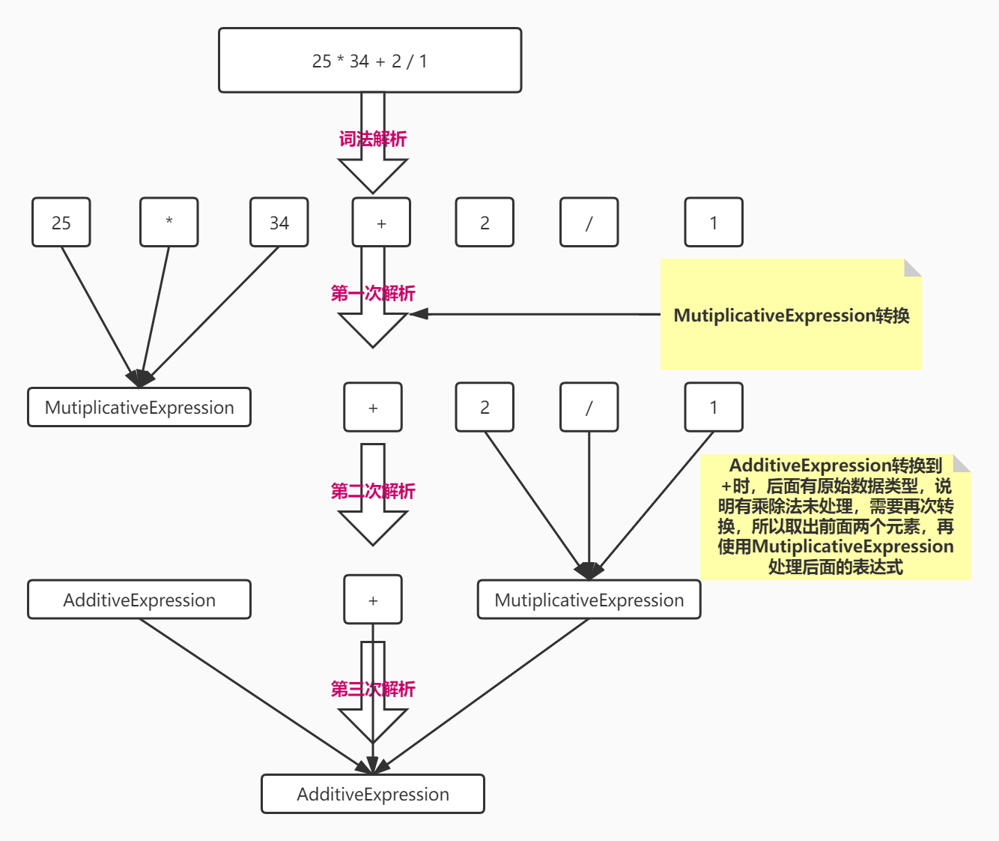

# 学习总结

## 一、正则表达式

此前对正则表达式的使用和学习并不多，在这里再次学习一下

### 1. 正则符号

|   符号   |                                        作用                                         |
| :------: | :---------------------------------------------------------------------------------: |
|   `^`    |                                从字符串开头开始匹配                                 |
|   `&`    |                                从字符串结尾开始匹配                                 |
|   `()`   |                                 括号内存放子表达式                                  |
|   `*`    |               匹配前一个字符或表达式0-n次 `/aa*/.test("abbb")//true`                |
|   `+`    |               匹配前一个字符或表达式1-n次 `/aa+/.test("abbb")//false`               |
|   `.`    | 匹配除 `\n` 之外所有单字符 `/aa.b/.test("aacb")//true; /aa.b/.test("aaccb")//false` |
|   `[`    |                             标记一个中括号表达式的开始                              |
|   `?`    |                     匹配前一个字符或表达式 `0-n` 次,与 `*` 类似                     |
|   `\`    |                         将下一个字符记为特殊字符或原意字符                          |
|   `|`    |                               指明两项之间的一个选择                                |
|  `{n}`   |             匹配前一个字符或表达式 `n` 次 `/ab{2}a/.test("abba")//true`             |
|  `{n,}`  |         至少匹配前一个字符或表达式 `n` 次 `/ab{2,}a/.test("abbba")//true`;          |
| `{n,m}`  |         匹配前一个字符或表达式 `n - m` 次 `/ab{2,4}a/.test("abbbba")//true`         |
|   `\S`   |                      匹配任意非空白字符 `/\S/.test("3")//true`                      |
|   `\s`   |                       匹配任何空白字符 `/\s/.test(" ")//true`                       |
| `[ABC]`  |            匹配方括号内中所有字符 `/[ab]/g.exec("abbbbbbcc") a index:0`             |
| `[^ABC]` |      匹配方括号内中除了上述元素所有字符 `/[^ab]/g.exec("abbbbbbcc") c index:7`      |
| `[A-Z]`  |                   匹配大写字母 `/[A-Z]/.exec("dsswA") A index:4`                    |
| `[\s\S]` |                                    匹配所有字符                                     |
|   `\w`   |     匹配字母、数字、下划线。等价于 `[A-Za-z0-9_]` `/\w/.exec("***b") b index:3`     |
|   `\i`   |                   不区分大小写 `/[A-Z]/i.exec("dsswA") d index:0`                   |
|   `\g`   |                                    全局搜索匹配                                     |


### 2. 使用方式

`match` : 

- 语法 : `str.match(regexp)`
- `str` : 要进行匹配的字符串.  
- `regexp` : 一个正则表达式(或者由 `RegExp()` 构造成的正则表达式)
- 1)如果有g全局标志,那么返回的数组保存的是,所有匹配的内容.
- 2)如果没有g全局标志,那么返回的数组 `arr.arr[0]` 保存的是完整的匹配. `arr[1]` 保存的是第一个括号里捕获的字串,依此类推 `arr[n]` 保存的是第n个括号捕获的内容.
- 例：
    ```javascript
        "dssweABG".match(/[A-Z]/g) // ["A", "B", "G"]
        "dssweABG".match(/[A-Z]/) 
        // {
        //     0: "A"
        //     groups: undefined
        //     index: 5
        //     input: "dssweABG"
        //     length: 1
        // }
    ```

`exec` : 
- 语法 : `var result1 = regexp.exec(str);`
- `regexp` : 正则表达式
- `str` : 要匹配的字串
- `exec` 与 `match` 的关联就是 `exec` (g有没有都无影响)就等价于不含有g全局标志的 `match`.即返回数组 `arr[0]` 为匹配的完整串.其余的为括号里捕获的字符串.
- 例:
  ```javascript
    /[A-Z]/i.exec("dsswA")
    //{
    //    0: "d"
    //    groups: undefined
    //    index: 0
    //    input: "dsswA"
    //    length: 1
    //}
  ```

## 二、词法分析与语法分析

### 1. 词法分析

词法分析阶段是编译过程的第一个阶段。这个阶段的任务是从左到右一个字符一个字符地读入源程序，即对构成源程序的字符流进行扫描然后根据构词规则识别单词(也称单词符号或符号)。

### 2. 语法分析

语法分析是编译过程的一个逻辑阶段。语法分析的任务是在词法分析的基础上将单词序列组合成各类语法短语，如“程序”，“语句”，“表达式”等等.语法分析程序判断源程序在结构上是否正确.源程序的结构由上下文无关文法描述.

### 3. 计算器词法解析

这次练习中词法解析较为简单，只需要一个有多个子表达式的正则表达式，再按照正则规则设置相应字典，通过循环解析到字符串匹配内容，再通过匹配位置获取字典名称，解析后，计算器字符串变为一个切割的数组，如所示：

```javascript
    "25 * 34 + 2 / 1"
    =>
    ["25", " ", "34", " ", "+", " ", "2", " ", "/", " ", "1"]
```

### 4.计算器语法解析

词法解析后，计算器字符串被解析优化为对象数组，结构分为三类:
  - 数字
  - 操作符
  - 空格换行等无作用类型

过滤完无作用类型后，在从左向右解析计算字符串时，我们使用递归方式将前两个类型逐步合并，由于计算器有计算优先级 ( 当前加减乘除中，乘除优先级大于加减 )，所以我们需要使用 `MutiplicativeExpression` 先处理高优先级算法，算法从左往右处理乘除规则，当遇到非乘除算法停止，转换过程如图所示：



转换后，我们就得到比较好处理的数据结构，此时我们如果需要计算结果，只需要按照结构一层一层的递归计算下去，每一层递归返回计算结果，即可获取最后计算结果。